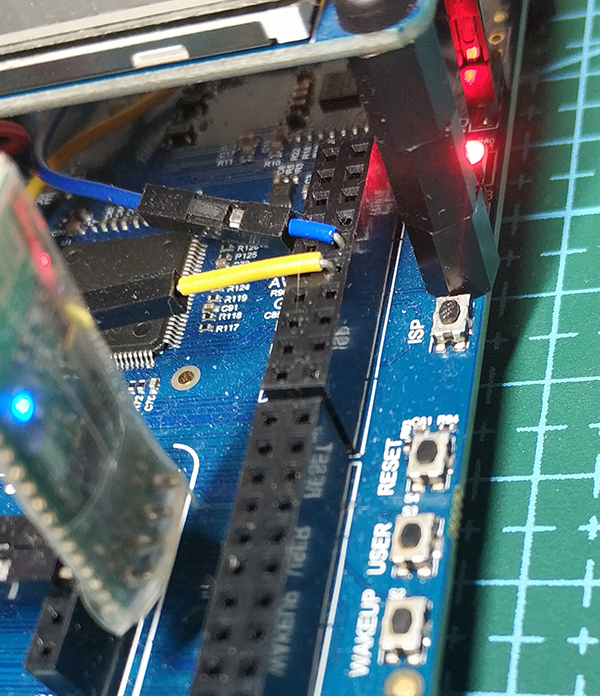
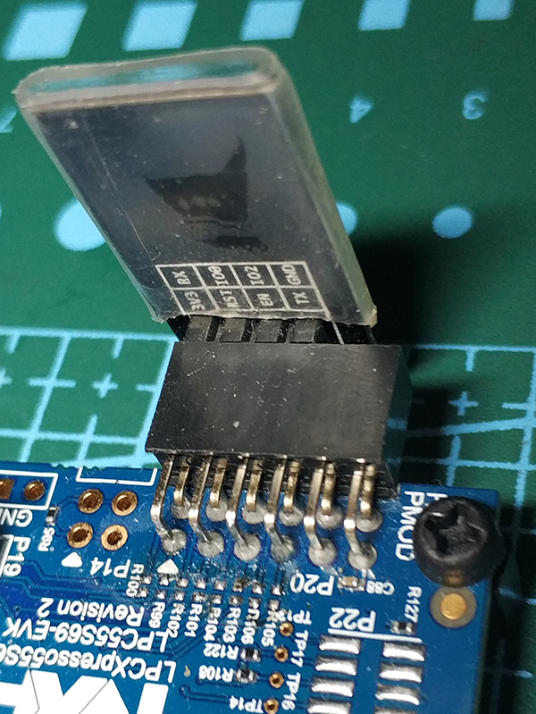
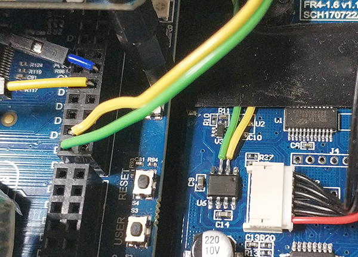
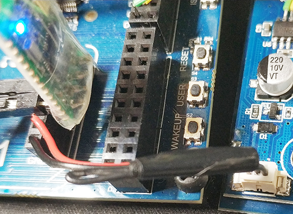

**这是一个Demo工程   
　　主要是使用NXP最新的ARM Cortex M33内核的双核心MCU LPC55S69的开发板实现了一个智能锁实例。锁的打开和关闭通过外部的实体锁芯进行演示，该锁可以通过调试串口，蓝牙模块通讯，LCD触摸，WIFI模块连接的OneNET云等多种方式进行控制，可以实现LCD触摸，web页面，手机APP等多种方式进行开锁和上锁。在双核系统中，所有的通讯都由Core0来实现，而锁的控制则由Core1来实现，双方通过通讯进行同步。**   

开发板扩展IO引脚使用情况：  
================
P17  
 
　　　　|　01　|　02　|　　　　  
　　　　|　03　|　04　|　　　　  
　　　　|　05　|　06　|FC1_TX　  
　　　　|　07　|　08　|　　　　  
　　　　|　09　|　10　|FC7_RX　  
　　　　|　11　|　12　|FC7_TX　  
　　　　|　13　|　14　|　　　　  
　　　　|　15　|　16　|　　　　  
　PIO1_5|　17　|　18　|　　　　  
　PIO1_8|　19　|　20　|　　　　  
 
P18  

　　　　|　01　|　02　|　　　　  
　FC1_RX|　03　|　04　|　　　　  
　　　　|　05　|　06　|　　　　  
　　　　|　07　|　08　|　　　　  
　　　　|　09　|　10　|　　　　  
　　　　|　11　|　12　|　　　　  
　FC2_TX|　13　|　14　|　　　　  
　FC2_RX|　15　|　16　|　　　　  
　　　　|　17　|　18　|　　　　  
　　　　|　19　|　20　|　　　　  
    
FC7接LCD屏幕  
FC2接蓝牙模块HC08  
FC1接WiFi模块ESP-01S  
PIO1_5和PIO1_6接锁驱动板  

串口LCD屏协议：  
================  
电源5V，通讯3.3V  
串口屏协议，发送ASCII码，内容"p0.pic=1"(关闭)或者"p0.pic=2"(打开)来控制界面显示开关状态，  
当界面点击开关时，串口会发送0x01(关闭)或者0x02(打开)  
串口波特率9600  

蓝牙串口协议  
================  
蓝牙协议，在这里使用HC-08蓝牙模块，电源3.3V，串口通讯  
串口波特率为9600  
接收到0x30开锁，接收到0x31上锁  
同样上锁时同步发送0x31，开锁时同步0x30  
  
WIFI串口协议  
================  
WiFi模块使用ESP-01S，电源3.3V，串口通讯，波特率115200.  
共有四部分需要处理  
建立连接和接入鉴权等  
中断接收需要处理  
定时发送状态  
状态改变及时同步    
    
主循环逻辑  
================  
检查调试串口是否收到数据，如果有进行处理  
检查WiFi串口是否收到数据，如果有进行处理  
检查蓝牙串口是否收到数据，如果有进行处理  
检查LCD串口是否收到数据，如果有进行处理  
定时发送数据到调试串口  
定时发送数据到蓝牙串口  
定时发送数据到WiFi串口  
定时发送数据到LCD串口  
检测锁状态变量的值，根据该值进行处理  
如果需要同步，则同步信息到LCD，WIFI，Debug串口等等  
延时10ms  
  
文件功能列表   
================  
Core0:  
1、smart_lock_cm33_core0/board/pin_mux.h和pin_mux.h，主要是用来定义IO的功能，这里使用到了四个串口  
2、smart_lock_cm33_core0/doc/readme.txt，主要用来说明本工程的一些信息。  
3、smart_lock_cm33_core0/Source/Common.h，主要是定义用到的一些数据类型  
4、smart_lock_cm33_core0/Source/MqttKit.h和MqttKit.c，是连接到OneNET云服务器的协议解析文件，移植自官方程序  
5、smart_lock_cm33_core0/Source/main_master.c本工程的主要文件，实现了蓝牙、调试串口连接，wifi连接到云服务器  
Core1:  
1、smart_lock_cm33_core1/board/pin_mux.h和pin_mux.c，主要是用来定义IO的功能，包括LED灯和锁驱动控制引脚  
2、smart_lock_cm33_core1/source/main_remote.c，主要实现了Core1内核的代码，接收Core0消息并控制LED灯和电子锁。  
  
实现的主要功能  
================  
1、可以通过调试串口进行控制锁状态，  
2、可以通过LCD屏幕控制锁状态。  
3、可以通过蓝牙控制锁状态。  
4、可以通过远程web或者手机app控制锁状态。  
5、所有控制途径进行了状态同步，比如在web页面修改状态后，在LCD和蓝牙上会同步状态。  

开发板硬件连接
==================
1、串口LCD屏  
串口LCD屏幕的发送和接收分别连接P17的10号和12号管脚。  
  
串口LCD屏幕的电源连接P16个20号管脚，即Vin，此处为5V电源。  
串口LCD屏幕的地线连接P8的GND管脚，实现共地。  
2、蓝牙模块  
HC-08的蓝牙模块的TXD和RXD引脚分别插入P24的RX和TX引脚，即3和4引脚。  
   
HC-08的电源连接到P23的+3.3V引脚，地线连接到GND引脚，实现共地。  
3、WiFi模块  
ESP-01S的WiFi模块插入P20的一号管脚一端，即靠近P14一侧的8个孔位，天线向上。 
   
4、电子锁模驱动模块  
锁驱动的黄线连接P17的17号管脚，即PIO1_5。  
锁驱动的绿线连接P17的19号管脚，即PIO1_8。  
   
锁驱动的红线即电源连接到P24的+5V电源引脚。  
锁驱动的黑线即GND连接到P24的GND引脚。  
   

软件配置
================
在源代码中，修改smart_lock_cm33_core0/source/main_master.c中37行  
#define ESP8266_WIFI_INFO	"AT+CWJAP=\"dell2330\",\"dadalula\"\r\n"  
中的代码，填入所在wifi网络的SSID替换dell2330，密码替换dadalula，确保wifi为2.4G网络。  
编译生成固件并写入开发板。  

功能演示
================
使用Micro USB先插入开发板的P6，也就是Debuglink端口，给开发板供电。  
1、LCD控制  
可以通过点按LCD屏幕上的开关实现对于实体锁芯的开锁和上锁控制，同时LED灯也可以表示锁的状态。  
   
2、蓝牙控制  
在android手机中安装HC-COM的app，启动后点击扫描设备，点击扫描到的HC-08，连接成功后发送u或者U
熄灭led灯，发送l或者L点亮LED灯。  
3、手机APP控制   
在android手机的app"设备云"中登录系统，点击应用，智能门锁，门锁开关页面就可以控制门锁的开关了。  
4、云端控制   
web端登录https://open.iot.10086.cn/  
登录后，点击开发者中心，蓝牙语音智能门锁，应用管理，智能门锁，在门锁控制页面就可以控制门锁的开合关了。 
5、调试串口控制  
USB连接PC与开发板的P6，安装驱动后使用串口调试助手打开仿真器附带的串口设备，波特率115200，8位无校验，1位停止位。发送"CMDSL1\r\n"点亮LED灯，发送"CMDSL0\r\n"熄灭LED灯。注意\r\n为回车换行。  

